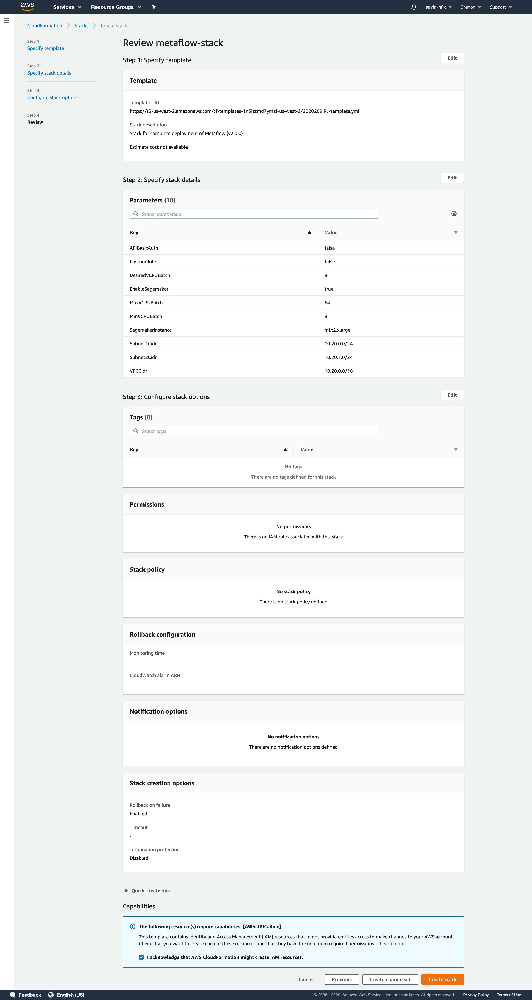
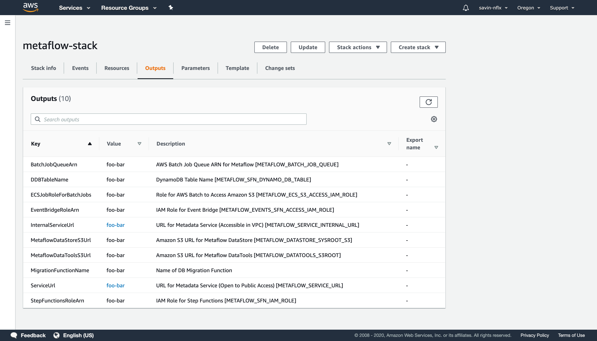

# AWS CloudFormation Deployment

Metaflow ships with an [AWS CloudFormation template](https://github.com/Netflix/metaflow-tools/tree/master/aws/cloudformation) that automates the deployment of all the AWS resources needed to enable cloud-scaling in Metaflow. The [Metaflow Sandbox](https://docs.metaflow.org/metaflow-on-aws/metaflow-sandbox) uses a version of this template to automatically vend out sandboxes for evaluating Metaflow.

The major components of the template are:

* **Amazon S3** - A dedicated private bucket and all appropriate permissions to serve as a centralized storage backend.
* **AWS Batch** - A dedicated AWS Batch Compute Environment and Job Queue to extend Metaflow's compute capabilities to the cloud.
* **Amazon CloudWatch** - Configuration to store and manage AWS Batch job execution logs.
* **AWS Step Functions** - A dedicated role to allow scheduling Metaflow flows on AWS Step Functions.
* **Amazon Event Bridge** - A dedicated role to allow time-based triggers for Metaflow flows configures on AWS Step Functions.
* **Amazon DynamoDB** - A dedicated Amazon DynamoDB table for tracking certain step executions on AWS Step Functions.
* **Amazon Sagemaker** - An Amazon Sagemaker Notebook instance for interfacing with Metaflow flows.
* **AWS Fargate and Amazon Relational Database Service** - A Metadata service running on AWS Fargate with a PostGres DB on Amazon Relational Database Service to log flow execution metadata.
* **Amazon API Gateway** -  A dedicated TLS termination point and an optional point of basic API authentication via key to provide secure, encrypted access to metadata service.
* **Amazon VPC Networking** - a VPC with \(2\) customizable subnets and Internet connectivity.
* **AWS Identity and Access Management** - Dedicated roles obeying "principle of least privilege" access to resources such as AWS Batch and Amazon Sagemaker Notebook instances.

## Steps for AWS CloudFormation Deployment

1. Navigate to _Services_ and select _CloudFormation_ under the _Management and Governance_ heading \(or search for it in the search bar\) in your AWS console.
2. Click _Create stack_ and select _With new resources \(standard\)_.
3. Download the template from [this location](https://github.com/Netflix/metaflow-tools/blob/master/aws/cloudformation/metaflow-cfn-template.yml) and save it locally.
4. Ensure _Template is ready_ remains selected, choose _Upload a template file_, and click _Choose file_ and upload the file saved in previous step.
5. Name your stack, select your parameters, and click _Next_, noting that if you enable _APIBasicAuth_ and/or _CustomRole_, further configuration will be required after deployment. 
6. If desired, feel free to tag your stack in whatever way best fits your organization. When finished, click _Next_.
7. Ensure you select the check box next to _I acknowledge that AWS CloudFormation might create IAM resources._ and click _Create stack_.
8. Wait roughly 10-15 minutes for deployment to complete. The Stack status will eventually change to _CREATE\_COMPLETE_.

Once complete, you'll find an _Outputs_ tab that contains values for the components generated by this CloudFormation template. Those values correlate to respective environment variables \(listed next to the outputs\) you'll set to enable cloud features within Metaflow.

### Additional Configuration

Did you choose to enable _APIBasicAuth_ and/or _CustomRole_ and are wondering how they work? Below are some details on what happens when those features are enabled and how to make use of them.

* **APIBasicAuth** - In addition to TLS termination, Amazon API Gateway provides the ability to generate an API key that restricts access only to requests that pass that API key in the 'x-api-key' HTTP header. This is useful in that it restricts access to flow information from the general Internet while still allowing remote connectivity to authenticated clients. However, enabling this feature means that you'll need to request the API Key from Amazon API Gateway, as exposing a credential as an output from CloudFormation is a potential security problem. CloudFormation does, however, output the ID of the API Key that correlates to your stack, making is easy to get the key and pass it to Metaflow. Follow one of the two instructions below to get `METAFLOW_SERVICE_AUTH_KEY`.
  1. From the AWS CLI, run the following: `aws apigateway get-api-key --api-key <YOUR_KEY_ID_FROM_CFN> --include-value | grep value`
  2. From the AWS Console, navigate to _Services_ and select _API Gateway_ from _Networking & Content Delivery_ \(or search for it in the search bar\). Click on your API, select _API Keys_ from the left side, select the API that corresponds to your Stack name, and click _show_ next to _API Key_.
* **CustomRole** - This template can create an optional role that can be assumed by users \(or applications\) that includes limited permissions to only the resources required by Metaflow, including access only to the Amazon S3 bucket, AWS Batch Compute Environment, and Amazon Sagemaker Notebook Instance created by this template. You will, however, need to modify the trust policy for the role to grant access to the principals \(users/roles/accounts\) who will assume it, and you'll also need to have your users configure an appropriate role-assumption profile. The ARN of the Custom Role can be found in the _Output_ tab of the CloudFormation stack under `MetaflowUserRoleArn`. To modify the trust policy to allow new principals, follow the directions [here](https://docs.aws.amazon.com/IAM/latest/UserGuide/roles-managingrole-editing-console.html#roles-managingrole_edit-trust-policy). Once you've granted access to the principals of your choice, have your users create a new Profile for the AWS CLI that assumes the role ARN by following the directions [here](https://docs.aws.amazon.com/cli/latest/userguide/cli-configure-role.html).

Once you have followed all these steps, you can [configure your metaflow installation](./#configuring-metaflow) using the outputs from the CloudFormation stack.

