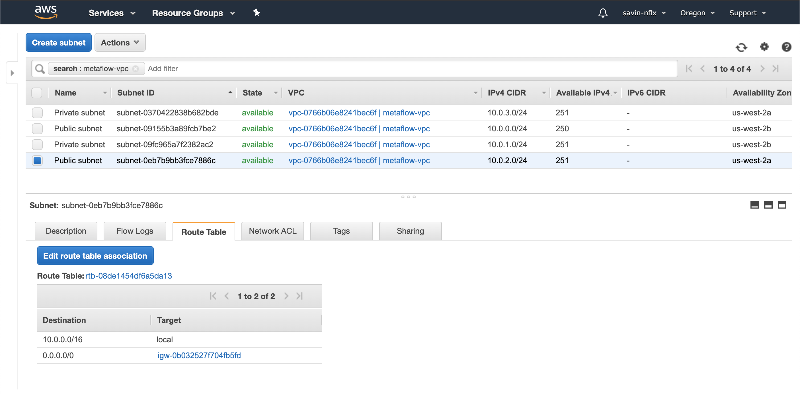
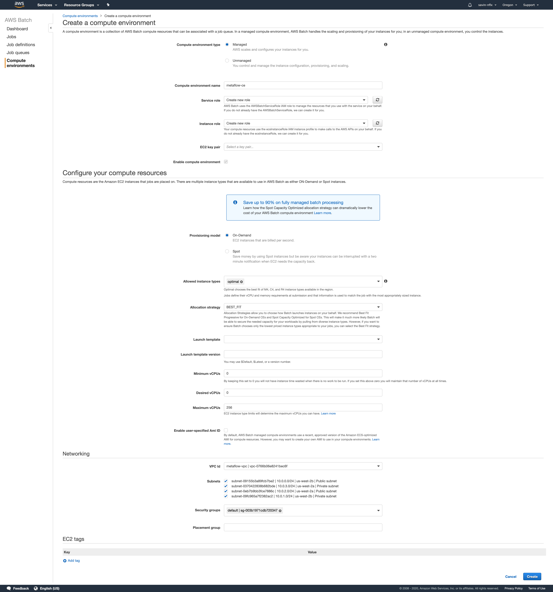
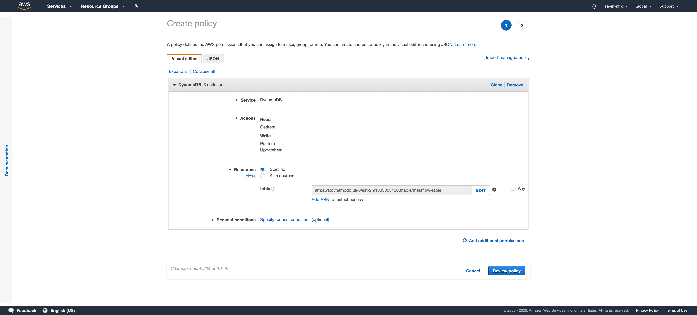
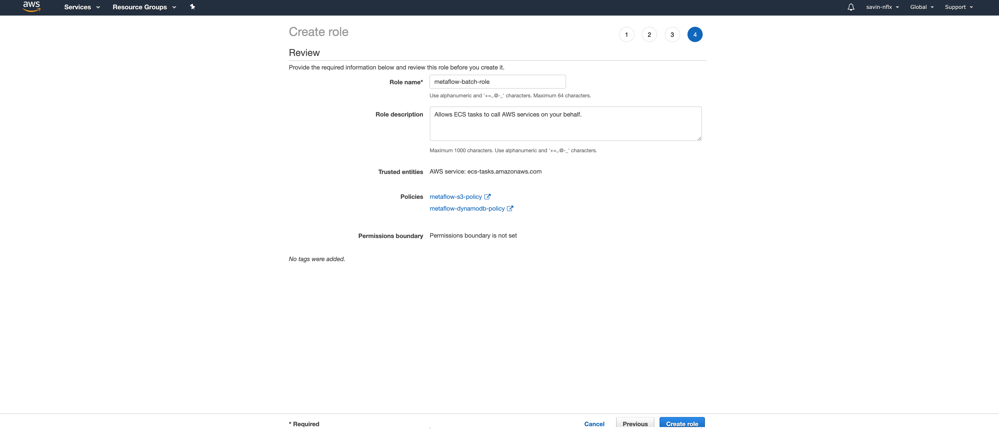

# Manual Deployment

There are many ways \(automated and manual\) to deploy, configure, and manage AWS resources depending on your security posture and familiarity with the AWS eco-system. If you cannot use [our AWS CloudFormation template](aws-cloudformation-deployment.md), this article lists the steps for a rather straightforward deployment of AWS resources for use by Metaflow. 

Please note that Metaflow can re-use existing AWS resources - for example, your existing AWS Batch job queue for job execution. The instructions listed here will create these resources from scratch. If you have a strong background in administering AWS resources, you will notice that many of the security policies are fairly permissive and are intended to serve as a starting point for more complex deployments. [Please reach out to us](https://docs.metaflow.org/introduction/getting-in-touch) if you would like to discuss more involved deployments.

## Steps for Manual Deployment

### Storage

Metaflow currently supports [Amazon S3](https://aws.amazon.com/s3/) as the storage backend for all the data that is generated during the execution of Metaflow flows. 

Metaflow stores all flow execution data \(user code, pickled object files, etc.\) in an S3 folder which is set as the variable `METAFLOW_DATASTORE_SYSROOT_S3` in the metaflow configuration. In case, you are using [metaflow.S3](https://docs.metaflow.org/metaflow/data#data-in-s-3-metaflow-s3), you can set the variable `METAFLOW_DATATOOLS_S3ROOT` to store your data in a specific folder in S3.

#### Create a private Amazon S3 bucket 

The following instructions will create a private S3 bucket for Metaflow -

1. Sign in to the AWS Management Console and open the [Amazon S3 console](https://console.aws.amazon.com/s3/).
2. Choose _Create bucket_.
3. In _Bucket name_, enter a DNS-compliant name for your bucket. Avoid including sensitive information, such as account numbers, in the bucket name. The bucket name is visible in the URLs that point to the objects in the bucket.
4. In _Region_, choose the AWS Region where you want the bucket to reside. Choose a Region close to you to minimize latency and costs.
5. In _Bucket settings for Block Public Access_, keep the values set to the defaults. By default Amazon S3 blocks all public access to your buckets. 
6. Choose _Create bucket_.


In this example, we created a private bucket `metaflow-s3`. While configuring Metaflow through `metaflow configure aws`, we can set the following values when prompted -

```python
METAFLOW_DATASTORE_SYSROOT_S3 = s3://metaflow-s3/flows
METAFLOW_DATASTORE_SYSROOT_S3 = s3://metaflow-s3/data-tools
```

### Compute

Metaflow currently supports scaling your compute via [AWS Batch](https://aws.amazon.com/batch/). Metaflow orchestrates this compute by leveraging Amazon S3 as the storage layer for code artifacts. If you want to use AWS Batch, you would have to configure Amazon S3 first following the instructions listed [previously](manual-deployment.md#storage).

Once you have set up your Amazon S3 bucket, you would need to set up an AWS Batch job queue and an IAM role that has permission to access Amazon S3 \(and other AWS services\). Jobs launched via Metaflow on AWS Batch will assume this role so that they can communicate with Amazon S3.

Before you can create a [job queue](https://docs.aws.amazon.com/batch/latest/userguide/job_queues.html), you would need to set up a [compute environment](https://docs.aws.amazon.com/batch/latest/userguide/compute_environments.html) that your job queue will eventually execute jobs on. There are many ways to create a compute environment depending on your specific use case. In most cases, a managed compute environment is sufficient, where AWS manages your compute resources with sensible defaults. But, if you prefer, you can create an unmanaged compute environment by following [these instructions from AWS](https://docs.aws.amazon.com/batch/latest/userguide/create-compute-environment.html). If you want to know how to create a managed compute environment, read on!

Compute resources in your compute environments need external network access to communicate with the Amazon ECS service endpoint. However, you might have jobs that you would like to run in private subnets. Creating a VPC with both public and private subnets provides you the flexibility to run jobs in either a public or private subnet. Jobs in the private subnets can access the internet through a NAT gateway. Before creating an AWS Batch compute environment, we would need to create a VPC with both public and private subnets.

#### Create a VPC

1. Create an Elastic IP Address for Your NAT Gateway
   1. Open the [Amazon VPC console](https://console.aws.amazon.com/vpc/).
   2. In the left navigation pane, choose _Elastic IPs_.
   3. Choose _Allocate new address, Allocate, Close_.
   4. Note the _Allocation ID_ for your newly created Elastic IP address; you will need this later in the VPC wizard.
2. Run the VPC Wizard
   1. In the left navigation pane, choose _VPC Dashboard_.
   2. Choose _Launch VPC Wizard, VPC with Public and Private Subnets, Select._
   3. For _VPC name_, give your VPC a unique name.
   4. For _Elastic IP Allocation ID_, choose the ID of the Elastic IP address that you created earlier.
   5. Choose _Create VPC_.
   6. When the wizard is finished, choose _OK_. Note the Availability Zone in which your VPC subnets were created. Your additional subnets should be created in a different Availability Zone. These subnets are not auto-assigned public IPv4 addresses. Instances launched in the public subnet must be assigned a public IPv4 address to communicate with the Amazon ECS service endpoint.
3. Create Additional Subnets

   The wizard in Step 2. creates a VPC with a single public and a single private subnet in a single Availability Zone. For greater availability, you should create at least one more of each subnet type in a different Availability Zone so that your VPC has both public and private subnets across two Availability Zones.

   1. To create an additional private subnet
      1. In the left navigation pane, choose _Subnets_.
      2. Choose _Create Subnet_.
      3. For _Name tag_, enter a name for your subnet, such as _Private subnet_.
      4. For _VPC_, choose the VPC that you created earlier.
      5. For _Availability Zone_, choose a different Availability Zone than your original subnets in the VPC.
      6. For _IPv4 CIDR block_, enter a valid CIDR block. For example, the wizard creates CIDR blocks in 10.0.0.0/24 and 10.0.1.0/24 by default. You could use 10.0.3.0/24 for your second private subnet.
      7. Choose _Yes, Create_.
   2. To create an additional public subnet
      1. In the left navigation pane, choose _Subnets_ and then _Create Subnet_.
      2. For _Name tag_, enter a name for your subnet, such as _Public subnet_.
      3. For _VPC_, choose the VPC that you created earlier.
      4. For _Availability Zone_, choose the same Availability Zone as the additional private subnet that you created in the previous procedure.
      5. For _IPv4 CIDR block_, enter a valid CIDR block. For example, the wizard creates CIDR blocks in 10.0.0.0/24 and 10.0.1.0/24 by default. You could use 10.0.2.0/24 for your second public subnet.
      6. Choose _Yes, Create_.
      7. Select the public subnet that you just created and choose _Route Table, Edit._
      8. By default, the private route table is selected. Choose the other available route table so that the _0.0.0.0/0_ destination is routed to the internet gateway \(_igw-xxxxxxxx_\) and choose _Save_.
      9. With your second public subnet still selected, choose _Subnet Actions, Modify auto-assign IP settings_.
      10. Select _Enable auto-assign public IPv4 address_ and choose _Save, Close_.



#### Create a managed AWS Batch compute environment

1. Open the [AWS Batch console](https://console.aws.amazon.com/batch/) and from the navigation bar, select the region to use.
2. In the navigation pane, choose _Compute environments, Create environment_.
3. Configure the environment.
   1. For _Compute environment type_, choose _Managed_.
   2. For _Compute environment name_, specify a unique name for your compute environment.
   3. For _Service role_, choose to have AWS create a new role for you.
   4. For _Instance role_, choose to have AWS create a new instance profile for you.
   5. For _EC2 key pair_ leave it empty.
   6. Ensure that _Enable compute environment_ is selected so that your compute environment can accept jobs from the AWS Batch job scheduler.
4. Configure your compute resources.
   1. For _Provisioning model_, choose _On-Demand_ to launch Amazon EC2 On-Demand Instances or _Spot_ to use Amazon EC2 Spot Instances.
   2. If you chose to use Spot Instances:
      1. \(Optional\) For _Maximum Price_, choose the maximum percentage that a Spot Instance price can be when compared with the On-Demand price for that instance type before instances are launched.
      2. For _Spot fleet role_, choose an existing [Amazon EC2 Spot Fleet IAM role](https://docs.aws.amazon.com/batch/latest/userguide/spot_fleet_IAM_role.html) to apply to your Spot compute environment.
   3. For _Allowed instance types_, choose the Amazon EC2 instance types that may be launched. You can specify instance families to launch any instance type within those families \(for example, c5, c5n, or p3\), or you can specify specific sizes within a family \(such as c5.8xlarge\).  You can also choose _optimal_ to pick instance types \(from the C, M, and R instance families\) on the fly that match the demand of your job queues. In order to use GPU scheduling, the compute environment must include instance types from the P or G families.
   4. For _Allocation strategy_, choose the allocation strategy to use when selecting instance types from the list of allowed instance types. For more information, see [Allocation Strategies](https://docs.aws.amazon.com/batch/latest/userguide/allocation-strategies.html).
   5. For _Minimum vCPUs_, choose the minimum number of EC2 vCPUs that your compute environment should maintain, regardless of job queue demand.
   6. For _Desired vCPUs_, choose the number of EC2 vCPUs that your compute environment should launch with.
   7. For _Maximum vCPUs_, choose the maximum number of EC2 vCPUs that your compute environment can scale out to, regardless of job queue demand.
   8. \(Optional\) Check _Enable user-specified AMI ID_ to use your own custom AMI. For more information on custom AMIs, see [Compute Resource AMIs](https://docs.aws.amazon.com/batch/latest/userguide/compute_resource_AMIs.html).
      1. For _AMI ID_, paste your custom AMI ID and choose _Validate AMI_.
5. Configure networking.
   1. For _VPC ID_, choose the VPC which you created [earlier](manual-deployment.md#create-a-vpc).
   2. For _Subnets_, choose which subnets in the selected VPC should host your instances. By default, all subnets within the selected VPC are chosen.
   3. For _Security groups_, choose a security group to attach to your instances. By default, the default security group for your VPC is chosen.
6. \(Optional\) Tag your instances so that it is helpful for recognizing your AWS Batch instances in the Amazon EC2 console.
7. Choose _Create_ to finish.



**Create an AWS Batch job queue**

1. Open the [AWS Batch console](https://console.aws.amazon.com/batch/) and select the region to use.
2. In the navigation pane, choose _Job queues, Create queue_.
3. For _Queue name_, enter a unique name for your job queue.
4. Ensure that _Enable job queue_ is selected so that your job queue can accept job submissions.
5. For _Priority_, enter an integer value for the job queue's priority. Job queues with a higher integer value are evaluated first when associated with the same compute environment.
6. In the _Connected compute environments for this queue_ section, select the [compute environment](manual-deployment.md#create-a-managed-aws-batch-compute-environment) that you just created.
7. Choose _Create_ to finish and create your job queue.


In this example, we create an AWS Batch job queue `metaflow-queue` following the steps listed above.

#### Create an IAM role

1. Open the [IAM console](https://console.aws.amazon.com/iam/).
2. In the navigation pane, choose _Policies_ and then choose _Create policy_.
3. Use the visual editor to create the policy 
   1. For _Service_, choose _S3_.
4. For **Actions**, expand the **Read** option and select **GetObject**.
5. For **Resources**, select **Add ARN** and enter the full Amazon Resource Name \(ARN\) of your Amazon S3 bucket, and then choose **Review policy**.
6. On the **Review policy** page, for **Name** type your own unique name, such as `AmazonECSTaskS3BucketPolicy`.
7. Choose **Create policy** to finish.

**To create an IAM role for your tasks**

1. Open the [IAM console](https://console.aws.amazon.com/iam/) and in the navigation pane, choose _Roles, Create role_.
2. For _Select type of trusted entity_ section, choose _AWS service_.
3. For _Choose the service that will use this role_, choose _Elastic Container Service_.
4. For _Select your use case_, choose _Elastic Container Service Task_ and choose _Next: Permissions_.
5. Next, we will create a policy for Amazon S3 and attach it to this role
   1. Amazon S3 for data storage
      1. Choose _Create Policy_ to open a new window.
      2. Use the visual service editor to create the policy
         1. For _Service_, choose _S3._
         2. For _Actions,_ add _GetObject, PutObject, DeleteObject_ and _List Bucket_ as allowed actions
         3. For _resources,_ for _bucket_ put in the bucket name create [earlier](manual-deployment.md#create-a-private-amazon-s3-bucket). For _object,_ use the same bucket name and choose any for _object name_. Choose _Save changes._
         4. Choose _Review policy._ On the _Review policy_ page, for _Name_ type your own unique name and choose _Create policy_ to finish.
   2. Amazon DynamoDB - Metaflow uses a DynamoDB table to track execution information for certain steps within AWS Step Functions. If you intend to use AWS Step Functions, you would need to create a policy for Amazon Dynamo DB as well.
      1. In the original pane \(in Step 4.\), Choose _Create Policy_ to open a new window.
      2. Use the visual service editor to create the policy
         1. For _Service_, choose _DynamoDB._
         2. For _Actions,_ add _PutItem, GetItem, DeleteObject_ and _UpdateItem_ as allowed actions
         3. For _resources,_ for _region_ put in the region in which you will create your AWS Dynamo DB table and for _table name,_ use a table name \(that you will create later while configuring AWS Step Functions\). Choose _Save changes._
         4. Choose _Review policy._ On the _Review policy_ page, for _Name_ type your own unique name and choose _Create policy_ to finish.
6. Click the _refresh_ button in the original pane \(in Step 4.\) and choose the policies that you just created \(in Step 5.\). Choose _Next:tags._
7. For _Add tags \(optional\)_, enter any metadata tags you want to associate with the IAM role, and then choose _Next: Review_.
8. For _Role name_, enter a name for your role and then choose _Create role_ to finish. Note the ARN of the IAM role you just created.






In this example, we created an AWS Batch job queue `metaflow-queue` and an IAM role `metaflow-batch-role`. While configuring Metaflow through `metaflow configure aws`, we can set the following values when prompted -exit: 

```text
METAFLOW_BATCH_JOB_QUEUE = metaflow-queue
METAFLOW_ECS_S3_ACCESS_IAM_ROLE = arn:aws:iam::xxxxxxxxxx:role/metaflow-batch-role
```

Metaflow allows setting up some additional defaults for the docker image that AWS Batch jobs execute on. By default, an appropriate Python image \(matching the minor version of Python interpreter used to launch the flow\) is pulled from docker hub. You can modify the behavior by either pointing to a specific image or a specific docker image repository using the following variables:

```text
METAFLOW_BATCH_CONTAINER_REGISTRY = foo
METAFLOW_BATCH_CONTAINER_IMAGE = bar
```

